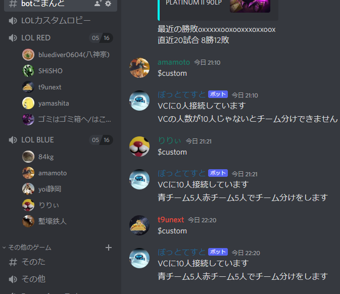

Discordというアプリ内で動くBOTを作成しました。
Discordでは、友人同士で使えるサーバーを作ったり、同じゲームをプレイするプレイヤーのコミュニティサーバーに参加したりすることができます。
そしてサーバーに参加している人とボイスチャットやテキストチャットでコミュニケーションをとれるといったサービスです。（skypeとかslackと似ています）

このBOTはDiscord用のAPIラッパーのdiscord.pyを使用して作成しました。自分のPC上で動かすこともできますが、それだとPCをつけっぱなしにしていないと使えないという欠点があります。
自分がPCをつけていない時でもフレンドがサーバー内でBOTの機能を使えるようにしたいので、Githubにリポジトリを置き、Herokuにデプロイして無料の範囲内でいつでもどこでも利用できるようにしています。

## 前準備

Discord Developer PortalでBOTを作成し、使いたいサーバーに招待、tokenをコピーして環境変数に入れておきます。コードの最後のbot.run(token)で使います。
あらかじめコマンド入力用のチャンネルIDを**BOT_COMMAND_CHANNEL_ID**に入れておきます。ボットからの返答やエラーメッセージが表示されるのもこのチャンネルです。
また、後述するチーム振り分け機能のための待機部屋、赤チーム、青チームのチャンネルIDもそれぞれ**taikibeya_ID** **red_team_ID** **blue_team_ID**に入れておきます。
ボイスチャンネル、テキストチャンネルともにチャンネルを右クリック後のコンテキストメニューからIDをコピーできます。

## 機能説明

### $ping
単にBOTが稼働しているかを確認するためのコマンドです。正常に稼働していればhelloと帰ってきます。

### $help
BOTのコマンドとか構文を確認するためのヘルプコマンドです。

### $custom <青チームの人数> <赤チームの人数>
待機部屋にいる人を入力された人数になるようにランダムで分けます。引数なしで単に$customと送信すると５人５人に分けられます。待機部屋にいる人数が入力された人数の合計と一致する必要があります。

### $rank <サモナーネーム>
入力されたサモナーネーム（以下SN）の日本サーバーでのLeague of Legendsのランク情報を表示します。OPGGの簡易版みたいな感じです。
$rank以降の引数をargsでまとめて受け取っているので、SNにスペースが入っている人がそのまま入力してもエラーが出ないようにしています。
RiotAPIの仕様上スペースの有無や大文字小文字の区別はしないみたいです。入力されたSNが存在しなければエラーを返します。

この画像はLOLカスタムロビーが待機部屋でそこからLOL RED, LOL BLUEにチーム分けされた時の画像です。

設定の参考https://qiita.com/1ntegrale9/items/aa4b373e8895273875a8
